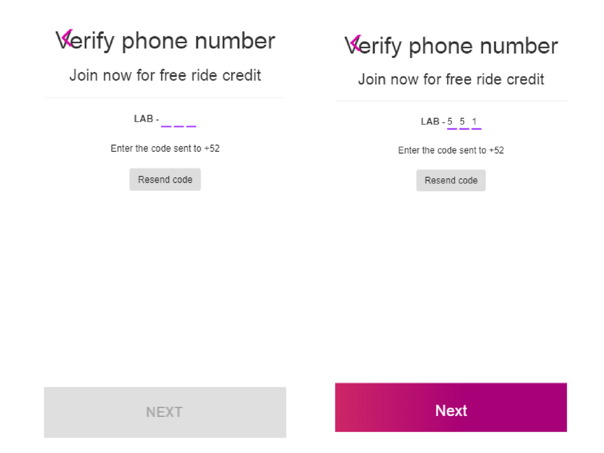

### Reto: Lyft
***

###  Objetivo:

*   Desarrollar una aplicación web de la página de Lyft, para registro de usuario.

###  Descripción:

*  El siguiente proyecto consiste en desarrollar una web-app que replique el sitio de Lyft, en este reto se deberá cumplir los pasos necesarios para que tu usuario pueda registrarse.

### Flujo de la aplicación:

* Vista splash con duración de 2 a 5 segundos que redirecciona a tu vista de inicio.
La vista de inicio cuenta con dos botones, en esta ocasión seguiremos el flujo de SING UP.

    

* En la siguiente vista tenemos un formulario donde nuestro usuario puede escoger el país y debe ingresar su número de teléfono. El botón de NEXT debe estar deshabilitado hasta que se ingrese un número de 10 dígitos.

    

* Una vez ingresado el número de teléfono se habilita el botón y al dar click debe enviar una alerta con un código generado aleatoriamente (LAB-000) y redireccionar a la siguiente vista.

    

* En esta vista se debe ingresar el código dado anteriormente y una vez hecho esto se habilita el botón que redirecciona a nuestro usuario a la vista donde ingresa sus datos. (Puede tener la opción de enviar otro código.)

  

* Para ingresar sus datos necesitamos un formulario que le pida su nombre, apellido y correo electrónico. Deberá también tener un checkbox para que se acepten los términos y condiciones del servicio.

  

* Ya que se ha realizado lo anterior, sólo se deberá mostrar una vista al usuario que le indique que ha concluido con el registro exitosamente.

  

**NOTA:** Todas nuestras vistas deben de contar con una manera de regresar a la vista anterior

***
###  Recursos Utilizados:
* HTML5.
* CSS.
* BOOTSTRAP.
* JAVASCRIPT.
* jQuery.
